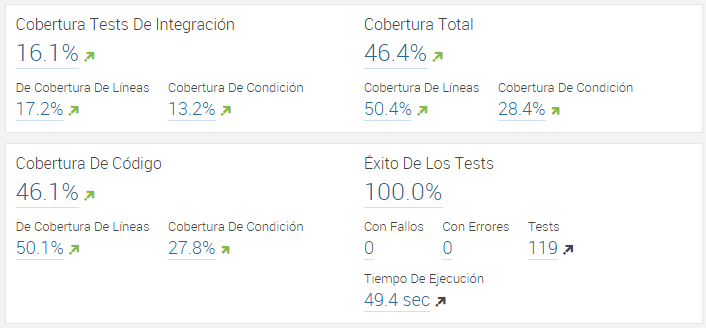

# Conclusión

## Métricas del producto
### Líneas de código
Capa|LOC
:--:|:--:
Frontend|561
Servicios|308
Backend|994

### Requerimientos implementados
Se implementó el 100% de los requerimientos planteados en la [planeación](chapters/c3/planeacion.md)

### Cubrimiento de pruebas

## Métricas del proceso
### Valor Ganado
Ver [Matriz de Requerimientos](chapters/3/Matriz_de_requerimientos2.md)
### Productividad del equipo

## Reflexión
### Estrella de mar
- Empezar a hacer
 - Reuniones cortas y frecuentes para hacer seguimiento.
 - Mejorar el uso de stormpath para la seguridad
- Seguir haciendo:
 - Comunicarnos constantemente
- Hacer más de:
 - Probar requerimientos antes de subirlos
 - Reuniones de seguimiento con una agenda específica
 - Refactoring
- Hacer menos de:
 - Trabajo independiente
 - Reuniones largas
 - Subestimar los requerimientos
- Dejar de hacer:
 - Dejar el desarrollo para último momento
 - Salirse de contexto en las reuniones
 - Manejar planeación en dos herramientas diferentes
 - Faltar a las reuniones programadas

### Nuevos integrantes
Los nuevos integrantes pudieron acoplarse al proceso del equipo rápidamente y lograron sacar adelante sus tareas asignadas al mismo ritmo que los antiguos integrantes.
### Trazabilidad de los requerimientos

### Implementación de pruebas
La implementación de las pruebas de la capa lógica permitió conocer un poco acerca de cómo debían realizarse y del funcionamiento de arquilian. Sin embargo, las pruebas de los servicios REST se presentaron como un reto ya que la seguridad de shiro, el uso de stormpath, y en general librerías incompatibles causaron que la implementación de estas pruebas fuese el mayor reto del ciclo.

## Plan de mejora para el ciclo 4
- Cambiar la manera de gestionar el equipo para evitar los problemas de organización que se presentaron en este ciclo.
- Aunque la tasa de deuda técnica se ha mantenido en 1%, planteamos como objetivo disminuir las horas que representan (actualmente 4d2h)
- Mejorar el manejo de la seguridad para hacer la aplicación más mantenible.