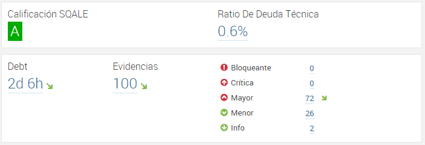

# Métricas
## Producto
### Líneas totales del ciclo
Capa|LoC
:--:|:--:
Front|216
Services|97
Back|386

Durante toda la duración del proyecto se buscó mantener la deuda técnica al mínimo. Este esfuerzo se ve reflejado en la gráfica de línea de tiempo de SonarQube:

El pico al inicio de la gráfica se debe a que accidentalmente se hizo commit de una librería, situación que se corrigió inmediatamente.

### Deuda técnica
Durante todo el semestre se procuró mantener la deuda técnica por debajo del 1%, objetivo que se cumplió totalmente. Finalmente, en el último ciclo se hizo un esfuerzo por reducir la deuda técnica y aumentar la cobertura de pruebas.

### Requerimientos completados
Para ver el estado de los requerimientos planeados revisar [Youtrack][youtrack4]
### Cobertura de pruebas
De acuerdo a la herramienta SonarQube, se tiene un cubrimiento de pruebas de 67.6%. Esto se logró principalmente haciendo pruebas de la capa lógica y los servicios REST.

## Proceso
### Valor ganado
Ver capítulo de [planeación][plan4]
### Productividad el equipo
Para ver la productividad del equipo revisar [reporte de tiempos ciclo 4][tc4]

[youtrack4]: http://appoteca.myjetbrains.com/youtrack/rest/agile/Appoteca-2/sprint/0.4.0

[tc4]: http://appoteca.myjetbrains.com/youtrack/reports/time/91-4

[plan4]: https://kaosterra.gitbooks.io/wiki-appoteca/content/chapters/4/planeacion.html