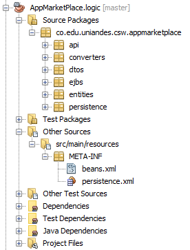
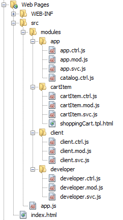
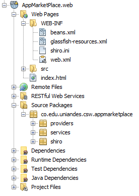

# Vista de desarrollo
La vista de desarrollo muestra la estructura de archivos para el proyecto. Inicialmente vemos la aplicación distribuida en 3 proyectos:

- `AppMarketPlace`: Proyecto Maven que agrupa los otros dos proyectos. Esto con fines de poder compilar y ejecutar pruebas para ambos proyectos más fácilmente.
- `AppMarketPlace.logic`: Proyecto con la lógica de negocio de la aplicación en el backend.
- `AppMarketPlace.web`: Proyecto Java Web con los servicios REST y los archivos de FrontEnd

## Proyecto AppMarketPlace.logic
Este proyecto contiene los archivos Java necesarios para cumplir con los requerimientos de la aplicación y comunicarse con la base de datos.

En este proyecto se encuentran los siguientes paquetes:

- `api`: Contiene las interfaces que han de implementar los EJB.
- `converters`: Clases que ayudan a realizar la conversión entre Entity y DTO.
- `dtos`: Data Transfer Objects - Representaciones de los datos transmitidos por REST.
- `ejbs`: Java Beans con la lógica de negocio.
- `entities`: Entidades JPA para mapeo con la base de datos.
- `persistence`: Java Beans para comunicación con la base de datos.

## Proyecto AppMarketPlace.web
Este proyecto se separa en dos grandes grupos de archivos. Aquellos correspondientes al FrontEnd, y aquellos correspondientes a los servicios RESTful.

### Estructura FrontEnd
En la ruta `src/main/webapp` se almacenan todos los archivos relacionados con el front-end. Dentro de esta carpeta encontramos los siguientes elementos:

- `index.html`: Punto de entrada para la aplicación web
- `app.js`: Archivo de configuración de la aplicación.
- Carpeta `src/modules`: Contiene los módulos de la aplicación AngularJS, donde cada puede contener los siguientes tipos de archivo:
  - `*.mod.js`: Archivos de configuración del módulo.
  - `*.svc.js`: Archivos con los servicios del módulo.
  - `*.ctrl.js`: Archivos con los controladores del módulo.
  - `*.tpl.html`: Plantillas propias del módulo.

### Estructura Servicios REST
En los archivos fuentes de Java, encontramos tres paquetes correspondientes a:

- `providers`: Filtros de Jersey para servicios REST.
- `services`: Implementación de los servicios REST.
- `shiro`: Filtros de Shiro para gestionar la seguridad.

Adicionalmente encontramos la carpeta WEB-INF que contiene:

- `beans.xml`:
- `glassfish-resources.xml`:
- `shiro.ini`:
- `web.xml`:

