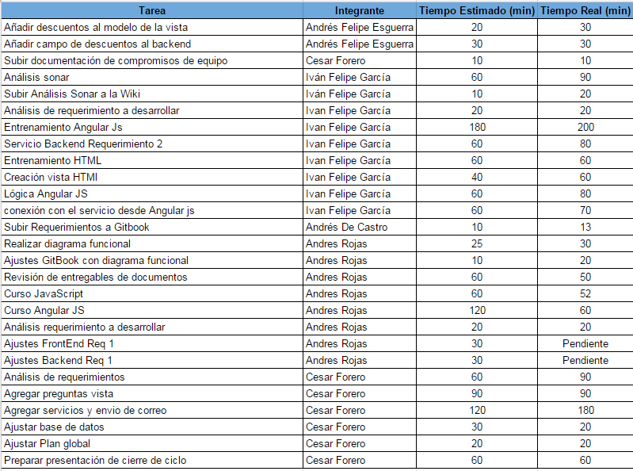

#Reporte de trabajo ciclo 1

A continuación presentamos un análisis del trabajo realizado en el primer ciclo de desarrollo. En este presentamos las cosas que salieron bien (Pulgar arriba) y las cosas que se pueden mejorar en este proceso.

## Balance de los objetivos del ciclo 1

1. Lograr un entendimiento del enunciado del proyecto, la aplicación actual, y el trabajo faltante con respecto a las expectativas del cliente.
    * La forma en que medimiamos si este objetivo se cumplia  era con la entrega de los requerimientos. Lamentablemente para este primer ciclo este objetivo no se alcanzo.

## Manejo de riesgos

1. No tener el entendimiento necesario sobre la arquitectura y las tecnologías usadas en el proyecto: **Riesgo materializado**
    * Aunque el grupo se comprometio con la autocapacitación y se manejo con el lider técnico, miembros del grupo no cumplieron con la entrega de los requerimientos en un 100%. 
    * Pese a la capacitación algunos miembros aún presentaban dudas en el desarrollo y no solicitaron apoyo a tiempo.
2. No tener un entendimeinto claro de los requerimientos: **Riesgo materializado**
    * Pese a que se definieron espacios para hablar de los requerimientos algunos miembros del grupo tuvieron errores en la implementación.
3. No trabajar de forma organizada y coordinada:
    * Se mantuvo un documento de tareas para llevar el control y en las reuniones se veia el avance de las tareas.

##Manejo de tareas

Se llevo tareas en el documento en drive para llevar un control de tiempo. Como parte de este proceso pudimos evidenciar como muchas de las tareas no fueron bien estimadas y devengaron de nosotros mucho más trabajo.

Es importante resaltar que para algunos miembros del equipo les costo llevar un control de tareas en el documento, por lo que muchas tareas iniciales y posteriores no se presentan en el listado.

Las tareas con los tiempos fueron: 

##Requerimientos

De los 5 requerimientos asignados para este primer ciclo el grupo solo cumplío a cabalidad 3, por lo que mantenemos deuda técnica sobre esos 2 requerimientos faltantes.

* Andrés Rojas: Opción de pagar la compra **Completada**
* Iván García: Agregar comentarios en los productos **Completada**
* César Forero : Registrar preguntas de un producto específico **Completada**
* Andrés De Castro: Realizar búsqueda del producto más barato **Incompletada**
* Andrés Esguerra: Ofrecer la posibilidad de agregar descuentos **InCompletada**

##Impacto en calidad de código

##Trabajo en equipo

Se resalta los siguientes puntos en la forma en que trabajo el equipo.

* Se cumplieron con las reuniones y la forma de trabajar.
* Hubo una buena comunicación entre los miembros del equipo y compromiso con las reuniones.
* Miembros del equipo no pedian ayuda a tiempo aunque no tenía conocimiento de las herramientas y presentaban dudas.
* Hubo puntos que no se respetaron de lo acordado por el grupo de trabajo, en especial de hacer push con funcionalidades sin funcionar.

##Conclusión

#### Pulgar arriba: 

* Se ha promovida la participación de todo el equipo en las decisiones que deben tomarse como equipo.
* Las herramientas definidas en un principio se han manejado de la forma esperada.
* Se ha sentido el compromiso del equipo con las tareas asignadas.
* Hubo disposición de los miembros del equipo para avanzar con los requerimientos y apoyar a los demás.

#### Pulgar abajo: 

* No todo el equipo solicito ayuda en el proceso de desarrollo creyendo que podrían manejarlo por su parte. Esto impacto el tiempo de entrega impidiendo cumplir en las fechas esperadas por el equipo.
* Se subestimaron algunas tareas y al final el tiempo no alcanzo para finalizarlas de la mejor manera.
* Hubo reglas que se tomarón en el equipo que por diversos razones al final no se mantuvieron fijas para todos.
* Hubo dudas en los requerimientos por parte de miembros del equipo que no se socializarón.

#### ¿Qué hacer para mejorar?: 

* Manejar reuniones de requerimientos antes de empezar el ciclo.
* Llevar un control de tareas más pequeñas a las que se le puedan hacer seguimiento.
* Comprometernos como equipo a llevar todas las dudas posibles a las reuniones.
* En caso que se requiera hacer una jornada de programación presencial para afinar detalles y cumplir requerimientos a tiempo. 