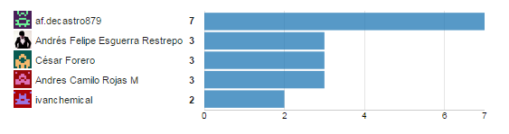

# Reporte de trabajo ciclo 2

A continuación presentamos un análisis del trabajo realizado en el segundo ciclo de desarrollo. En este presentamos las cosas que salieron bien (Pulgar arriba) y las cosas que se pueden mejorar en el proceso.

## Balance de los objetivos del ciclo

1. Revisar de forma crítica lo realizado en el ciclo anterior en cuanto al producto y al proceso, para definir mejoras en el ciclo 2
    * El grupo cumplio con el arreglo de los issues del primer ciclo, desafortunadamente no se tomarón como prioridad lo que demando de algunos miembros del grupo realizar las tareas al final del ciclo al tiempo que los requerimientos.
2. Producir un incremento funcional en la aplicación que incluya pruebas automatizadas.
    * Todos los miembros del grupo tuvieron al menos un requerimiento asignado y cumplieron con todos. Consideramos que para próximos ciclos podemos incrementar la carga sobre los miembros del equipo.
3. Estimar el tiempo de construcción de los artefactos del ciclo 2 del producto
    * Se realizó una estimación de cada uno de los artefactos, sin embargo, consideramos que tuvimos sobreestimación en algunas tareas y desestimación en otras.
4. Realizar una planeación semanal
    * Como equipo realizamos una planeación semanal pero no cumplimos con las tareas estimadas, por ello nuestra gráfica de valor ganado presenta un incremento sustancial en la última parte del ciclo.
    * Como equipo fallamos en llevar tareas más pequeñas, en youtrack solo fueron registradas tareas grandes y no fueron subdivididas en otras para llevar un mejor control.
5. Utilizar el concepto de valor ganado para hacer el seguimiento
    *Aunque manejamos una tabla de porcentajes de valor ganado muchas tareas no fueron desarrolladas en el  tiempo esperado por lo que en la tabla aparece que no cumplimos con el 100% del lo planeado.

### Individual

1. Incluir en su plan de acción las acciones de mejora propuestas en la conclusión del ciclo 1
    * Todos los miembros de grupo cumplieron con lo pactado en sus compromisos individuales.
2. Participar, colaborar, proponer, atender las reuniones, seguir cumpliendo las reglas de funcionamiento
    * Como grupo fallamos en el compromiso con las reuniones de seguimiento y planeación por lo que muchas de las tareas en el plan de valor ganado no reflejan el porcentaje que se requería.
3. Entender los objetivos del ciclo 2
    * Como equipo fallamos en llevar una mejor planeación en tareas más pequeñas y en el control y planeación de estas.

## Manejo de riesgos
* La carga académica de otras clases puede afectar el ritmo de trabajo del equipo. **Materializado**: Durante las tres semanas varios miembros del equipo tuvieron dificultad gestionando el tiempo para las reuniones. Fue difícil reunirnos todos, lo cual hacía que las reuniones se hicieran en horas de la noche hasta la madrugada.
* La curva de aprendizaje de YouTrack puede afectar la precisión de los reportes. **Materializado**: Entender YouTrack afectó un poco en el seguimiento ya que no podíamos identificar cómo separar los issues por semana.

## Manejo de tareas
Se usa la herramienta YouTrack para gestionar los requerimientos existentes y el registro de tiempos. Se repartió la carga entre los diferentes miembros del equipo y se procedió a trabajar en los requerimientos.

## Impacto en calidad de código

La deuda tecnica fue uno de los ítems por los que más nos preocupamos en este ciclo, asignamos tareas para poder reducir este aspecto ya que en el ciclo anterior la aumentamos de manera significativa. Al finalizar el ciclo anterior contabamos con una deuda técnica de 3 días la cual consideramos alta. En este ciclo tenemos una deuda técnica de 2 dias y 3 horas, logramos reducir esta deuda técnica casi por un día.

El número de líneas de código en este ciclo aumentó por 2.000 líneas de código ya que se implementaron los requerimientos que no terminamos el ciclo pasado más los requerimientos asignados para este ciclo, sin embargo, la deuda técnica se redujo. De igual manera el código duplicado también se redujo de manera significativa debido al refactoring que hicimos en este ciclo.

Para ver en detalle el análisis en el impacto del código revisa "Análisis de código/Ciclo2".

###Evaluación 

####Métricas Producto:

* Requerimientos Planeados Vs Requerimientos terminados
* Tamaño Real (LOCS).
* % Error de Estimación de tamaño
* Deuda Técnica: Comparación con el ciclo anterior y análisis

####Métricas Proceso:

* % Estimación de error de Esfuerzo total por grupo y por individuo
* Gráfica de valor ganado y análisis (adjuntar reportes individuales de tareas planeadas vs tareas finalizadas)
* Evaluación de los objetivos del ciclo con base en las métricas propuestas

## Conclusión
#### Pulgar arriba:
* Se cumplieron con todos los requerimientos y con los issues del ciclo anterior.
* hubo una buena comunicación en el grupo lo que nos permitio salir a flote con respecto a dudas y problemas presentados.
* Hubo un buen manejo del repositorio y de las ramas de desarrollo, así como de las fechas definidas para entrega.

#### Pulgar abajo:
* No hubo un buen cumplimiento con las reuniones de planeación y seguimiento.
* No se mantuvo un proceso de dividir las historias en más pequeñas para llevar un mejor control.

#### Medidas para mejorar en el siguiente ciclo

* Dividir tareas de desarrollo en tareas más pequeñas que nos permitan tener un mejor control y seguimiento de las tareas.
* Llevar una mejor relación en las tareas realizadas en youtrack y las tareas en el excel de planeación.
* Tomar como base otro criterio de selección de las tareas del ciclo para evitar tener tiempo ocioso en algunos miembros del equipo.

